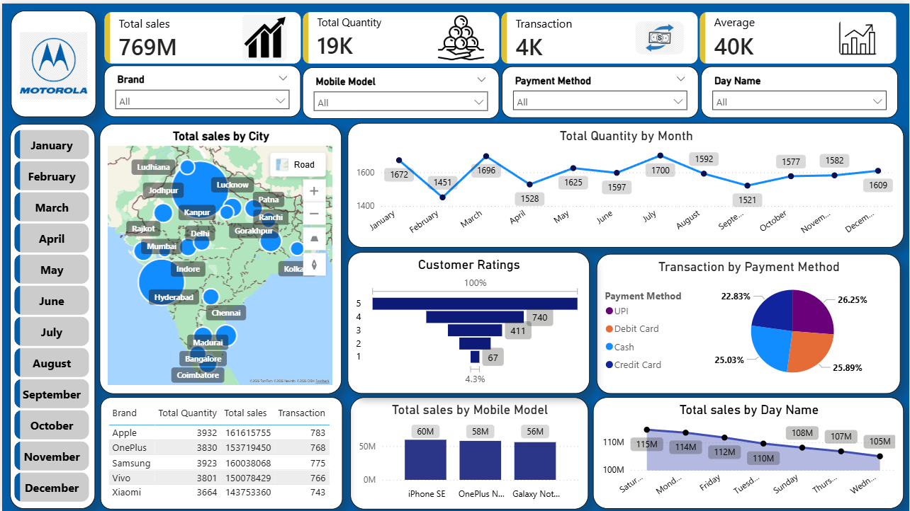

# Mobile Sales Dashboard (Power BI)

## Project Overview
This project is an interactive `Power BI dashboard` that analyzes mobile sales data across different cities, months, brands, and payment methods.

## Key Insights
- Total Sales: 769M
- Total Quantity Sold: 19K
- Total Transactions: 4K
- Average Sales Value: 40K

## Features
- City-wise sales map
- Monthly sales trend analysis
- Customer ratings visualization
- Payment method distribution
- Brand and mobile model performance

## Tools Used
- Power BI
- DAX
- Data Modeling

## Dashboard Preview

